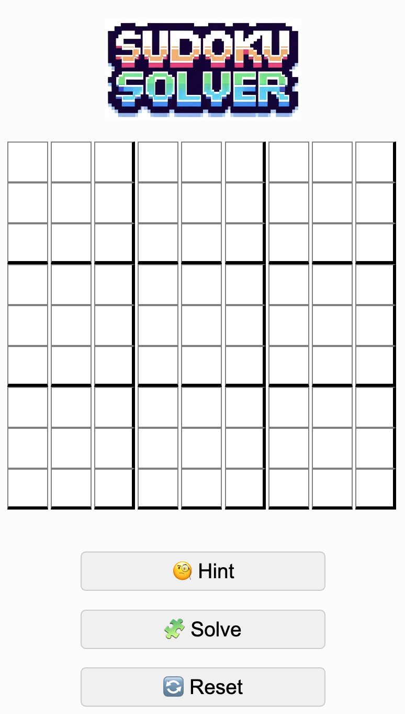

# Sudoku Solver

## Introduction
A simple, web-based Sudoku Solver. This is my first personal project/app, designed to solve Sudoku puzzles interactively. This uses the standard "backtesting" algorithm to solve the puzzle in JavaScript.

## Technologies Used
- HTML
- CSS
- JavaScript

## Features
- Interactive Sudoku grid to input puzzles.
- 'Solve' button to automatically solve the puzzles.
- 'Hint' button to get a single hint at a time.
- 'Reset' button to clear the grid.
- Responsive design for mobile and desktop views.

## How to Use
1. Enter numbers into the Sudoku grid.
2. Click on 'Hint' to receive help with one cell.
3. Use 'Solve' to find the solution for the entire puzzle.
4. 'Reset' clears the grid for a new puzzle.

## Screenshots
